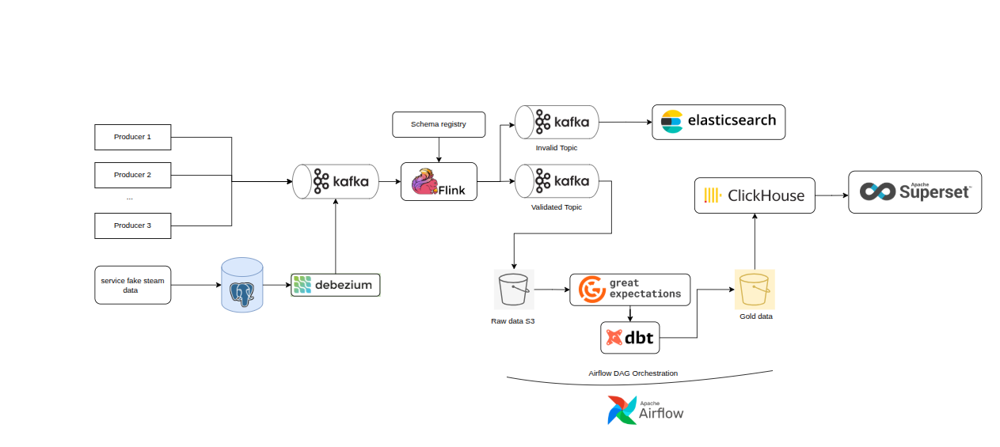

## Create namespace
```bash
kubectl create namespace storage-ns       # MinIO, S3, DVC
kubectl create namespace ingestion-ns     # Debezium, Kafka Connect
kubectl create namespace streaming-ns     # Kafka, Schema Registry
kubectl create namespace processing-ns    # Spark, Flink
kubectl create namespace validation-ns    # Great Expectations
kubectl create namespace metadata-ns      # DataHub
kubectl create namespace orchestration-ns # Airflow
```

## Install Minio with helm
```bash
kubens storage-ns 

helm repo add minio https://charts.min.io/

helm repo update

helm pull minio/minio --untar

helm upgrade --install minio minio/minio -f minio/minio-values.yaml -n storage-ns

# get username password for minio
kubectl get secret --namespace storage-ns minio -o jsonpath="{.data.rootUser}" | base64 --decode

kubectl get secret --namespace storage-ns minio -o jsonpath="{.data.rootPassword}" | base64 --decode

# options
kubectl apply -f minio/minio-external-service.yaml -n storage-ns 

```

## Setup Kafka KRaft with helm

```bash
kubens ingestion-ns 

helm repo add bitnami https://charts.bitnami.com/bitnami

helm repo update

helm pull bitnami/kafka --untar

helm upgrade --install kafka ./kafka -f kafka/kafka-values.yaml -n ingestion-ns

# test kafka
**
CLIENT_PASSWORD=$(kubectl get secret kafka-user-passwords -n ingestion-ns -o jsonpath='{.data.client-passwords}' | base64 --decode)
echo "Client Password: $CLIENT_PASSWORD"

kubectl exec -it kafka-controller-0  -n ingestion-ns -- bash

# Create file topics
cat > /tmp/client.properties << EOF
security.protocol=SASL_PLAINTEXT
sasl.mechanism=PLAIN
sasl.jaas.config=org.apache.kafka.common.security.plain.PlainLoginModule required username="user1" password="$CLIENT_PASSWORD";
EOF

# Test list topics 
kubectl exec -it kafka-controller-0  -n ingestion-ns -- kafka-topics.sh \
  --bootstrap-server localhost:9092 \
  --command-config /tmp/client.properties \
  --list

# Test create topics
kubectl exec -it kafka-controller-0  -n ingestion-ns -- kafka-topics.sh \
  --bootstrap-server localhost:9092 \
  --command-config /tmp/client.properties \
  --create --topic test-sasl-topic \
  --partitions 1 --replication-factor 1

# setup Schema Registry connect to kafka

helm pull bitnami/schema-registry --untar

helm upgrade --install schema-registry ./schema-registry -n ingestion-ns

```
## Create metadata for data for validation
```bash
# Generate metadata for WIDER FACE validation images (minimal set)
# Optimized for test environment with small dataset
python src/generate_minimal_metadata.py
```

# Create Kafka Topics cho Face Detection Pipeline
```bash
bash scripts/create_topic_kafka.sh 
```
