<!-- Architecture review doc — Face Detection MLOps L1→L2→L3+RAG, best-of-breed single cluster. Read top-to-bottom. -->
# Face-Detect MLOps — Architecture Review (Best-of-Breed, L1 → L2 → L3 + RAG)

> **Mục đích:** để bạn **đọc & review kiến trúc + chức năng từng tool** trước khi build. Plan chi tiết: [``](plan.md).
>
> **Giả định:** **1 cluster K8s phần cứng thoải mái** (có GPU), chỉ cần **chia namespace chuẩn**. Stack chọn theo **best-of-breed 2026**, không thỏa hiệp tài nguyên.
> **Trạng thái:** L1 = đã chạy. L2/L3/RAG = thiết kế, chưa deploy. Output đợt này = **plan + sơ đồ để review**.
> **Lựa chọn đã chốt:** vector DB = **Qdrant** · logs = **ELK** · tracing = **Jaeger** · data versioning = **lakeFS** · + Iceberg/Trino/Feast/Ray/vLLM/Kubeflow-full/Istio-ambient/OpenMetadata/ArgoCD/Vault/Kyverno/Thanos.

---

## 1. Tổng quan hệ thống (Overview)

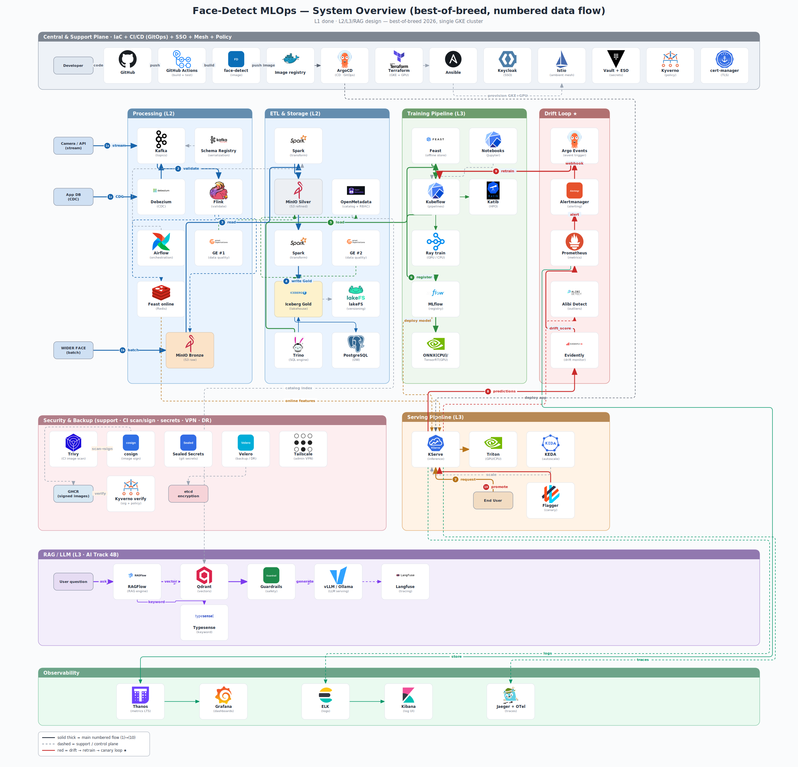

> Layout cột dọc (column-based) + numbered steps (1)→(10) + named artifacts — bố cục theo bản Gemini reference, card style lấy cảm hứng từ [fullstackdatascience.com/hall-of-fame](https://fullstackdatascience.com/hall-of-fame).
> 🔍 **Xem nét (zoom):** [`diagrams/icons/01-overview.svg`](diagrams/icons/01-overview.svg) — vector, phóng to không vỡ.
> ✏️ **Sửa tiếp:** [`diagrams/icons/01-overview.drawio`](diagrams/icons/01-overview.drawio) — mở [draw.io](https://app.diagrams.net) (logo nhúng base64, routing giữ nguyên như PNG nhờ waypoints; **mũi tên flow chính (1)→(10) có hiệu ứng chạy** `flowAnimation` khi mở trong draw.io).
>
> *Bố cục: band **Central & Support Plane** trên cùng, 4 **cột pipeline dọc** (Processing / ETL & Storage / Training / Drift Loop) đứng cạnh nhau — dữ liệu chảy trái→phải, sources (WIDER FACE / Camera / App DB) tách riêng mép trái — box **Serving Pipeline** nằm dưới 2 cột phải, band RAG + Observability dưới cùng. Mỗi tool là **card trắng đổ bóng 150×112** (icon lớn + tên đậm + caption vai trò), 3 tầng medallion **MinIO Bronze / Silver / Iceberg Gold** được highlight nền màu, bước flow đánh số bằng **badge tròn màu** (1b)→(10), mỗi zone có **dải header màu đậm**. Vòng drift→retrain (đỏ) giờ là cạnh ngắn Drift→Training kề nhau; long-haul chạy trên 2 rail phải (deploy / telemetry) và các gutter ngang giữa zone → không đường nào cắt qua thân card. Legend góc dưới trái. Re-render: `python3 diagrams/icons/overview_builder.py` (xem `diagrams/icons/REGENERATE.md`).*

| Level | Trả lời câu hỏi | Best-of-breed |
|---|---|---|
| **L1** (done) | "Phục vụ model?" | FastAPI+YOLOv11, Jenkins, Prometheus/Grafana/ELK/Jaeger |
| **L2** (data) | "Data sạch, versioned, governed?" | Kafka(Strimzi)·Flink·Spark·**Iceberg lakehouse**·**lakeFS**·**Trino**·Great Expectations·Airflow·**OpenMetadata** |
| **L3** (platform) | "Train tự động + serve production?" | **Kubeflow**·Katib·MLflow·**Feast**·**Ray** / KServe·Triton·KEDA·Flagger·Iter8 / **Evidently+Alibi Detect drift loop** |
| **L3+RAG** (4B) | "Hỏi-đáp ngôn ngữ tự nhiên?" | **vLLM**·RAGFlow·**Qdrant**·Typesense·**NeMo Guardrails**·Langfuse |

**Điểm nhấn:** vòng lặp **Drift → Retrain → Canary** (T4) — thứ tách MLOps thật khỏi "deploy model lên k8s".

---

## 1b. Sơ đồ App chi tiết (app-centric — bản nâng cấp của `images/architecture.png`)

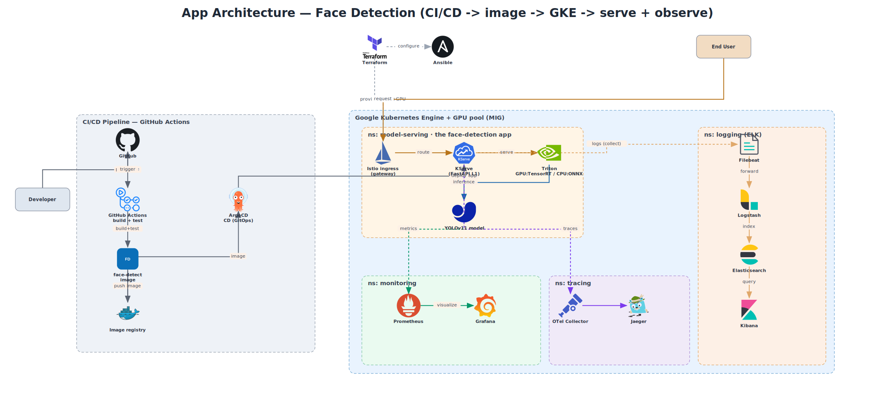

> Bám sát hình cũ của bạn nhưng stack mới: `Developer → GitHub → GitHub Actions (build+test) → **face-detect image** → registry → ArgoCD → **GKE/model-serving** (Istio → KServe → Triton → YOLOv11)`; `End User → request → app`; observability từ app: metrics→Prometheus/Grafana · traces→OTel/Jaeger · logs→Filebeat→Logstash→Elasticsearch→Kibana. IaC: Terraform+Ansible provision GKE+GPU.
> ✏️ **Sửa tiếp:** [`diagrams/icons/00-app-architecture.drawio`](diagrams/icons/00-app-architecture.drawio)

---

## 📂 File sơ đồ draw.io — chỉnh tiếp & update tại đây

> Mở bằng [draw.io](https://app.diagrams.net) (web/desktop) hoặc VS Code extension **"Draw.io Integration"**. Logo nhúng base64 (không cần file ngoài). Sửa xong: **File → Export as → PNG/SVG** rồi commit lại.

Thư mục gốc: `diagrams/icons/`

| Sơ đồ | File `.drawio` (đường dẫn) |
|---|---|
| **App Architecture** (app-centric, giống hình cũ) | `00-app-architecture.drawio` |
| **Overview** (tổng quan, layout cột) | `01-overview.drawio` |
| Drill-down T1 — Data Pipeline | `drilldown/zone-1-data.drawio` |
| Drill-down T2 — Training | `drilldown/zone-2-training.drawio` |
| Drill-down T3 — Serving | `drilldown/zone-3-serving.drawio` |
| Drill-down T4 — Drift loop ★ | `drilldown/zone-4-drift-loop.drawio` |
| Drill-down T5 — RAG | `drilldown/zone-5-rag.drawio` |
| Drill-down T0 — Platform | `drilldown/zone-6-platform.drawio` |
| Drill-down T6 — Observability | `drilldown/zone-7-observability.drawio` |

Vẽ lại hàng loạt (đổi tool/toạ độ): sửa `overview_builder.py` / `drilldown/drilldowns.py` rồi chạy (cần `cairosvg` + icons trong `/tmp/icons/png` — chạy `prep_icons.py`, `drilldown/prep_icons2.py`, `rebuild_icons.py` trước nếu `/tmp` đã bị xoá). Engine routing dùng chung: `diagram_render_lib.py` + `corridor_router.py`. Spec từng zone: [`diagram-drawing-guide.md`](diagram-drawing-guide.md).

---

## 2. Chia namespace chuẩn + Governance

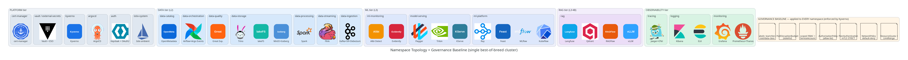

**~20 namespace, mỗi cái = 1 domain** (platform·data·ml·rag·observability). **Governance baseline ép bằng Kyverno cho MỌI namespace:** ResourceQuota+LimitRange · NetworkPolicy default-deny · Istio mTLS STRICT · AuthorizationPolicy allow-list · scoped RBAC+ServiceAccount · PodDisruptionBudget · labels `team/tier/cost/data-class` · PriorityClass.

---

## 3. Nguyên tắc thiết kế

1. **1 tool / vai trò** — best-of-breed nhưng coherent (không 3 vector DB, không 2 mesh). Phần cứng giải quyết RAM, **không** giải quyết phức tạp vận hành.
2. **Namespace = ranh giới** — isolation + quota + netpol + mTLS + RBAC per namespace.
3. **GitOps tất cả** — ArgoCD app-of-apps; Kyverno ép chuẩn; Vault giữ secret.
4. **Lakehouse mở** — Iceberg (ACID/time-travel) + lakeFS (git-for-data) + Trino (SQL) → reproducible + governed.
5. **Tách orchestrator** — Airflow (data ETL) vs Kubeflow (ML training).
6. **SSO 1 nguồn** — Keycloak → mọi UI/tool qua OIDC, 6 role.

---

## 3b. Compute: CPU vs GPU — 2 profile (máy bạn hiện chưa có GPU)

> **Kết luận quan trọng:** kiến trúc / tool list / namespace / sơ đồ **KHÔNG đổi** giữa CPU và GPU. Chỉ **4 component** đổi *backend*, switch bằng **Helm values** (1 bộ manifest, 2 values). → bắt đầu **CPU-only ngay** trên máy bạn, bật GPU sau khi có node GPU mà không phải vẽ/dựng lại.

### Chỉ 4 chỗ phụ thuộc GPU

| Thành phần | GPU (khi có) | CPU-only (bắt đầu ngay) | Ảnh hưởng |
|---|---|---|---|
| **Inference engine** (serving) | Triton + **TensorRT INT8** | Triton/KServe **ONNX Runtime CPU** (hoặc giữ FastAPI L1) | CPU chậm hơn ~5–10× nhưng chạy tốt (YOLOv11 ~100ms/ảnh CPU đã OK ở L1) |
| **Model optimize** | TensorRT INT8 (GPU-only) | **ONNX Runtime / OpenVINO** graph-opt (CPU) | Bỏ INT8 GPU; mAP giữ nguyên, chỉ kém tốc độ |
| **Training / retrain** | Ray + GPU (nhanh) | Ray/Kubeflow **CPU** | CPU train YOLOv11 chậm (~1h+/epoch) → demo dùng ít epoch / dataset nhỏ / fine-tune |
| **LLM serving (RAG)** | **vLLM** (GPU, throughput cao) | **Ollama / llama.cpp** (CPU, model GGUF nhỏ: TinyLlama, Qwen2.5-0.5B) | CPU chạy được model nhỏ, chậm hơn — đủ cho demo RAG |

### ~40 tool còn lại = CPU 100% (không cần GPU)
Kafka · Schema Registry · Debezium · Kafka Connect · Spark · Flink · MinIO · Iceberg · lakeFS · Trino · PostgreSQL · Redis · Great Expectations · Airflow · Argo · OpenMetadata · KServe (control-plane) · MLflow · Feast · Katib (orchestration) · Kubeflow · KEDA · Flagger · Iter8 · Evidently · Alibi Detect · Prometheus · Thanos · Grafana · Alertmanager · Qdrant · Typesense · Langfuse · RAGFlow · NeMo Guardrails · embedding (BGE/MiniLM) · Istio · Keycloak · OAuth2 Proxy · ArgoCD · Vault · Kyverno · cert-manager · ELK · Jaeger · OTel.

### 2 profile dùng chung 1 bộ manifest
- **`values-cpu.yaml` (máy bạn — bắt đầu ngay):** Triton ONNX-CPU (hoặc FastAPI L1) · export ONNX/OpenVINO · train CPU ít epoch · RAG = Ollama. → **học & chạy được TOÀN BỘ vòng lặp MLOps**, chỉ chậm ở infer/train/LLM.
- **`values-gpu.yaml` (khi có GPU / GKE GPU pool):** bật Triton TensorRT · vLLM · Ray GPU · MIG/Kueue. Chỉ đổi values, **không đổi chart/kiến trúc**.

> Trên sơ đồ: các node GPU đã ghi rõ cả 2 lựa chọn (vd "Triton — GPU:TensorRT / CPU:ONNX", "vLLM (GPU) / Ollama (CPU)", "GPU pool (optional) / CPU fallback").

---

## 4. Chi tiết từng phần (drill-down — mỗi zone 1 file draw.io chỉnh tiếp được)

> Mỗi ảnh dưới là **drill-down chi tiết** (namespace containers + numbered steps + named artifacts), render cùng engine corridor + **card style** đồng bộ hình overview (card trắng đổ bóng, badge số tròn, header zone dải màu). Link ✏️ là file `.drawio` editable (waypoints + animation flow chính); mỗi zone cũng có `.svg` cùng tên để zoom nét. Re-render cả 7: `python3 diagrams/icons/drilldown/drilldowns.py`.

### T1 — Data Pipeline (L2)
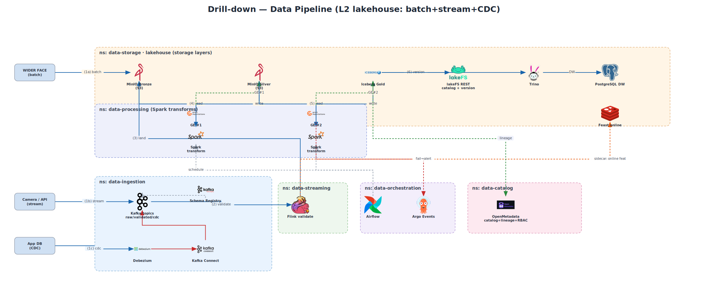
✏️ [`drilldown/zone-1-data.drawio`](diagrams/icons/drilldown/zone-1-data.drawio)

| Tool | Chức năng |
|---|---|
| **Kafka KRaft (Strimzi)** + Schema Registry + Debezium + Kafka Connect | event streaming, schema Avro, CDC từ WAL |
| **Flink** | stream validate real-time, exactly-once |
| **Spark** | batch ETL Bronze→Silver→Gold |
| **MinIO + Apache Iceberg** | data lake S3 + table format ACID/time-travel/schema-evolution |
| **lakeFS** | git-for-data: branch/commit/rollback → reproducible training set |
| **Trino** | federated SQL trên Iceberg |
| **PostgreSQL / Redis** | serving metadata / online cache |
| **Great Expectations** | 2 quality gates |
| **Airflow + Argo Events** | ETL DAG + event-driven |
| **OpenMetadata** | catalog + column-lineage + **RBAC theo SSO** |

### T2 — ML Platform (L3)
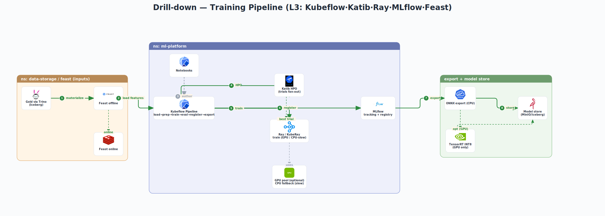
✏️ [`drilldown/zone-2-training.drawio`](diagrams/icons/drilldown/zone-2-training.drawio)

| Tool | Chức năng |
|---|---|
| **Kubeflow** (Pipelines/Notebooks/Katib/Profiles) | training DAG + explore + HPO + multi-user theo role SSO |
| **Ray / KubeRay** | distributed train/tuning ở scale (GPU) |
| **MLflow** | experiment tracking + model registry (stage) |
| **Feast** | feature store: offline (Iceberg/Trino) + online (Redis), consistency train/serve |
| **ONNX / TensorRT** | export tối ưu (INT8 GPU) |

### T3 — Serving (L3)
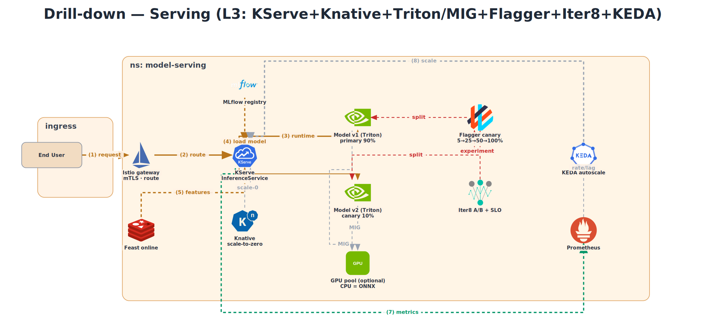
✏️ [`drilldown/zone-3-serving.drawio`](diagrams/icons/drilldown/zone-3-serving.drawio)

| Tool | Chức năng |
|---|---|
| **KServe** | InferenceService: routing, canary, autoscale |
| **Knative** | scale-to-zero |
| **Triton + TensorRT** | inference engine GPU, dynamic batching |
| **KEDA** | event-driven autoscale |
| **Flagger** | progressive canary + auto-rollback |
| **Iter8** | A/B + SLO experiment |

### T4 — Drift → Retrain → Canary Loop ★ (centerpiece)
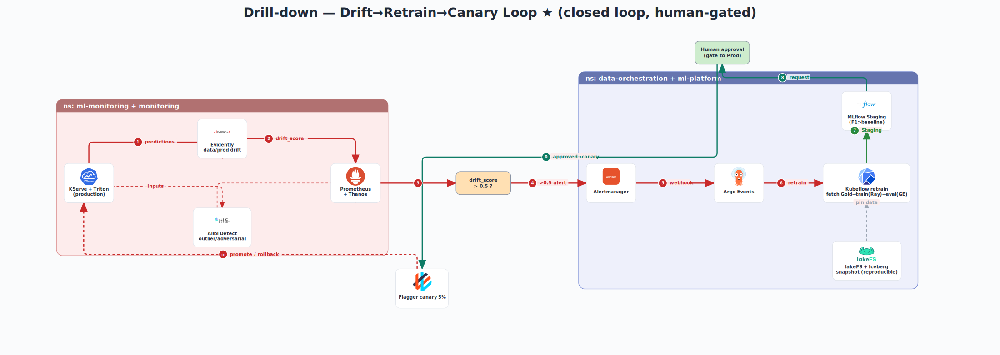
✏️ [`drilldown/zone-4-drift-loop.drawio`](diagrams/icons/drilldown/zone-4-drift-loop.drawio) · *có human-approval gate + lakeFS/Iceberg snapshot reproducible*

| Tool | Chức năng |
|---|---|
| **Evidently** | data/prediction drift (KS-test/PSI) |
| **Alibi Detect** | outlier + adversarial detection |
| **Prometheus + Thanos** | metrics + alert + long-term |
| **Alertmanager + Argo Events** | alert → webhook → trigger pipeline |
| **Kubeflow + MLflow** | retrain + eval + Staging |
| **Flagger** | canary promote/rollback |

**Vòng lặp:** predictions → Evidently/Alibi → Prometheus alert → Argo Events → Kubeflow retrain (Ray, data pin bằng lakeFS+Iceberg) → MLflow Staging → Flagger canary → promote/rollback → restart.

### T5 — RAG / LLM (L3 · 4B)
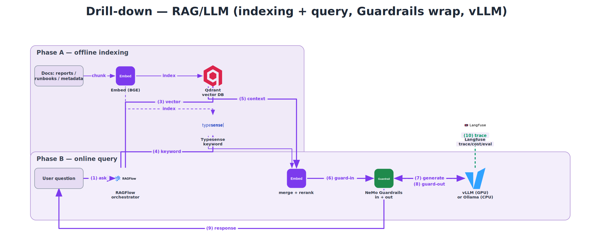
✏️ [`drilldown/zone-5-rag.drawio`](diagrams/icons/drilldown/zone-5-rag.drawio)

| Tool | Chức năng |
|---|---|
| **vLLM** | LLM serving GPU (paged-attention, throughput cao) |
| **RAGFlow** | orchestrator chunk/retrieve/generate |
| **Qdrant** | vector DB (hybrid search) |
| **Typesense** | keyword/faceted search |
| **NeMo Guardrails** | jailbreak/hallucination/PII guard |
| **Langfuse** | LLM observability (trace/cost/eval) |

### T0 — Platform (GitOps · SSO · Mesh · Policy)
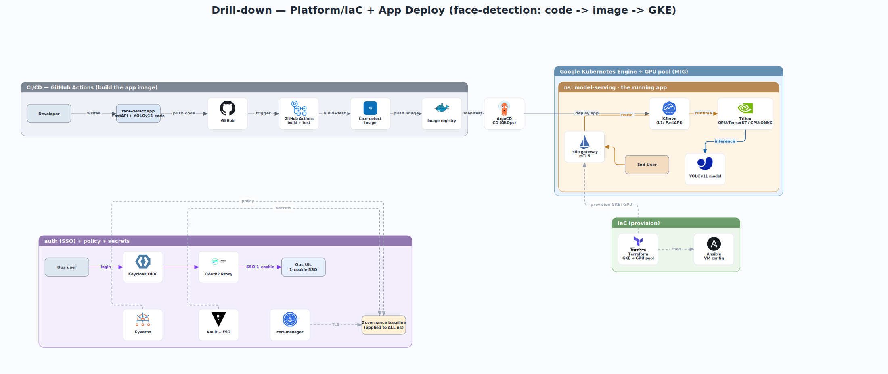
✏️ [`drilldown/zone-6-platform.drawio`](diagrams/icons/drilldown/zone-6-platform.drawio)

### T6 — Observability (metrics · logs · traces)
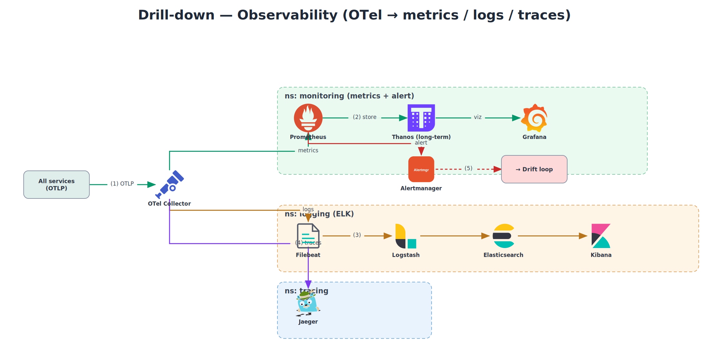
✏️ [`drilldown/zone-7-observability.drawio`](diagrams/icons/drilldown/zone-7-observability.drawio)

| Tool | Chức năng |
|---|---|
| **Istio ambient** | mesh sidecar-less, mTLS STRICT, gateway |
| **Keycloak + OAuth2 Proxy** | SSO OIDC, 6 role, 1 cookie `*.face-detect.dev` |
| **ArgoCD / Kyverno / Vault + ESO / cert-manager** | GitOps / policy / secrets / TLS |
| **Prometheus + Thanos + Grafana** | metrics HA + long-term + dashboard |
| **ELK** (ES+Kibana+Logstash+Filebeat) | log full-text search |
| **Jaeger + OTel Collector** | tracing + telemetry hợp nhất |

---

## 4b. Sơ đồ vận hành (ops — quyết định 260612)

> 3 sơ đồ mới phản ánh review 260612 (CI/CD + security red-team + RAM reality-check — [report](../plans/reports/brainstorm-review-260612-1453-cicd-security-redteam-plan-review-report.md)). **8 sơ đồ kiến trúc trên KHÔNG đổi** — các quyết định này là vận hành/triển khai, không đổi tool/namespace/data-flow.
> Source `.mmd` (Mermaid, editable) cạnh PNG/SVG. Re-render: `npx -y -p @mermaid-js/mermaid-cli mmdc -i <file>.mmd -o <file>.png -p puppeteer-config.json -b white -s 2.5` (puppeteer-config.json = `{"args":["--no-sandbox"]}`).

### Ops-1 — Resource Budget & On/Off + Node Topology
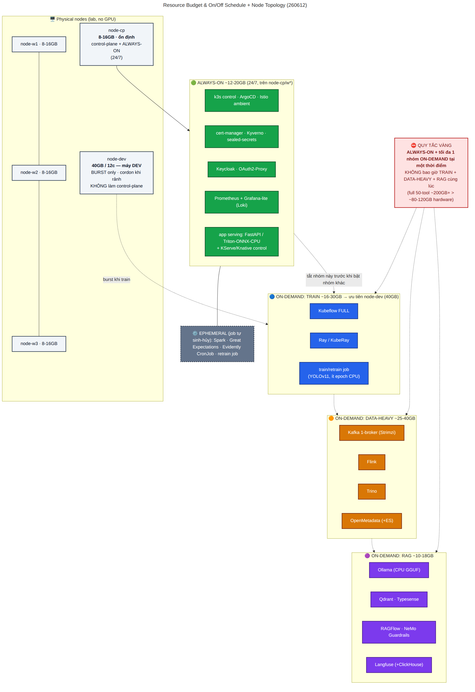

> **Quy tắc vàng:** ALWAYS-ON (~12-20GB, node nhỏ ổn định) + tối đa **1 nhóm ON-DEMAND** tại một thời điểm (TRAIN ~16-30GB trên node-dev 40GB burst · DATA-HEAVY ~25-40GB · RAG ~10-18GB). Không bao giờ 3 nhóm cùng lúc — full 50-tool ~200GB+ > hardware ~80-120GB.

### Ops-2 — Security Exposure Boundary (public vs private)
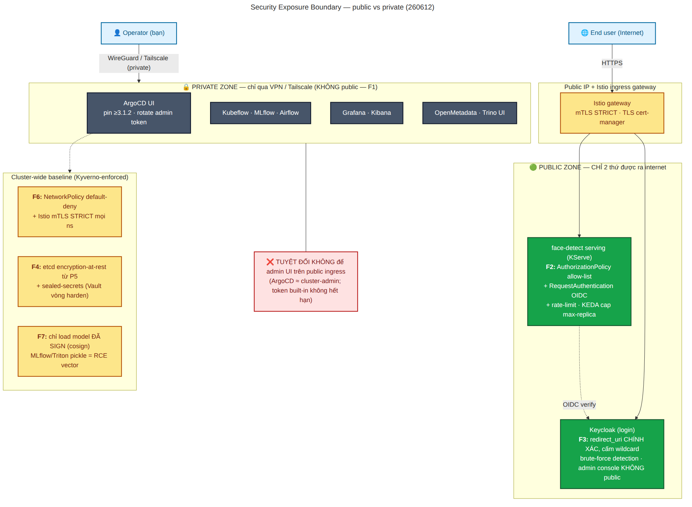

> **CHỈ** serving + Keycloak ra public ingress (kèm gate F2/F3). Mọi admin UI (ArgoCD/Kubeflow/Grafana/Kibana/MLflow/OpenMetadata) → VPN/Tailscale. Baseline Kyverno: default-deny + mTLS STRICT + etcd encryption + model phải sign.

### Ops-3 — CI/CD GitOps round-trip (monorepo · GitHub-hosted runner · ArgoCD pull)
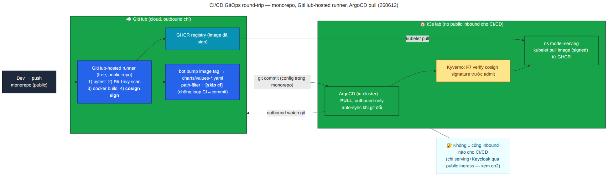

> Repo public → runner cloud free → Trivy + cosign → GHCR → bot bump tag (path-filter + `[skip ci]` chống loop) → ArgoCD **pull** (outbound-only) → Kyverno verify signature → deploy. **Không 1 cổng inbound nào cho CI/CD.**

### Ops-4 — Day-by-Day Roadmap (critical path vs độc lập + nhóm RAM)
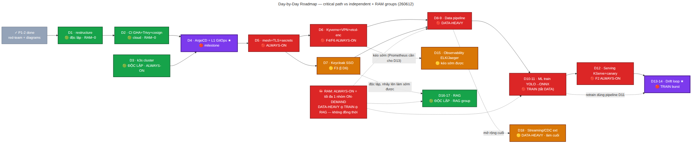

> 🟢 độc lập (D1/D2/D3/RAG) · 🔴 critical path · 🟡 gần độc lập · 🟣 milestone (D4 L1-GitOps, D13-14 drift loop). Lịch chi tiết + test case từng ngày: [`plans/260611-.../day-by-day-setup-schedule.md`](../plans/260611-0000-monorepo-gitops-implementation/day-by-day-setup-schedule.md).

---

## 5. SSO + RBAC theo role (xuyên suốt)

1 IdP **Keycloak** → mọi tool nhận role qua OIDC:

| Role | Quyền (Kubeflow Profile + OpenMetadata policy + Grafana/MLflow/Airflow/Kibana) |
|---|---|
| `data-analyst` | đọc Gold + dashboards + catalog (no PII) |
| `data-scientist` | Notebooks + Feast + MLflow + read features/models |
| `data-engineer` | Airflow + Flink/Spark UI + catalog edit + lineage |
| `ml-engineer` | KServe/Triton + Evidently + MLflow + serving metadata |
| `admin` | toàn quyền |
| `user` | chỉ inference API |

---

## 6. Hai kịch bản end-to-end

**A. Inference online:** `User → Istio gateway(mTLS) → KServe → Triton(GPU) → response`; song song `→ Prometheus/ELK/Jaeger`, `→ Evidently`.

**B. Closed loop:** `drift → Prometheus alert → Argo Events → Kubeflow retrain → MLflow Staging → Flagger canary 5% → promote 100% / rollback`.

---

## 7. Câu hỏi mở (cần bạn quyết khi review)

1. **GPU node pool**: bao nhiêu GPU? 3 nơi dùng — Ray (train), Triton (serve), vLLM (RAG). MIG/time-slicing hay tách pool?
2. **Ground-truth** cho drift loop: manual label / active learning?
3. **MLflow Staging→Production**: auto theo threshold hay human-approval (Kubeflow approval)?
4. **RAG**: deploy thật hay giữ design? Tách repo riêng?
5. **Iceberg catalog**: REST catalog / Nessie / Hive Metastore?

---

## 8. Tài liệu liên quan
- **▶ Step-by-step để tự build (Helm + GitHub Actions, CPU-first):** [`implementation-steps.md`](implementation-steps.md)
- Master plan + 7 phase: [`plan.md`](plan.md)
- Research validation 2026: [`researcher-260604-2213-mlops-l2-l3-stack-validation-report.md`](researcher-260604-2213-mlops-l2-l3-stack-validation-report.md)
- Sơ đồ icon (8): [`plans/260604-2213-.../diagrams/icons/`](diagrams/icons/)
